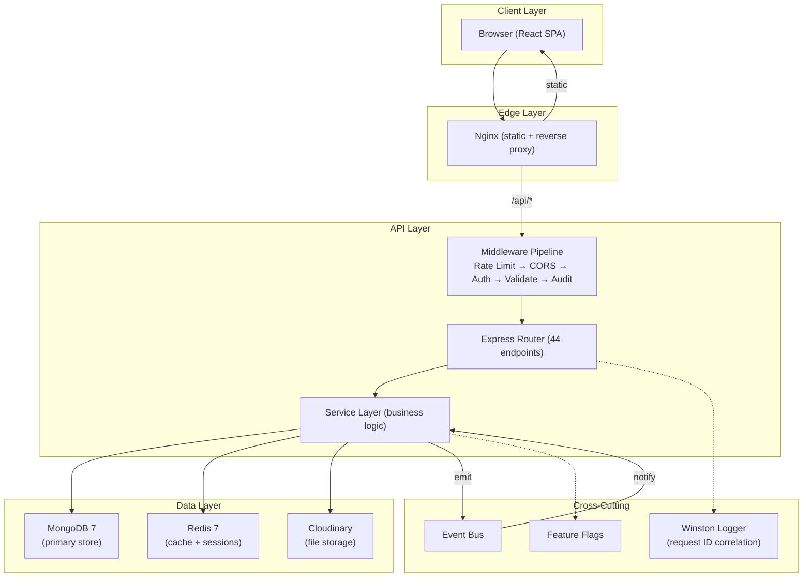
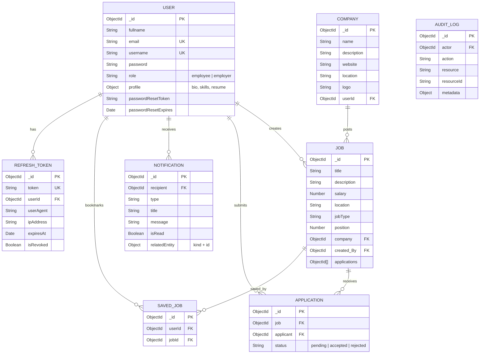

<div align="center">

# 🏗️ RozgarHub

**A Production-Grade Job Portal for Blue-Collar Workers**

[](https://github.com/kenzo0p/RozgarHub/actions/workflows/ci.yml)
[](https://www.typescriptlang.org/)
[](https://nodejs.org/)
[](https://www.mongodb.com/)
[](https://redis.io/)
[](https://www.docker.com/)
[](https://opensource.org/licenses/ISC)

*Connecting employers with skilled workers — electricians, plumbers, carpenters, drivers, and more.*

[Architecture](#architecture) · [Features](#features) · [Tech Stack](#tech-stack) · [Quick Start](#quick-start) · [API Reference](#api-reference) · [Engineering Highlights](#engineering-highlights)

</div>

---

## Architecture



### Database Schema



---

## Features

### For Workers (Employees)
- 🔍 **Smart Job Search** — Filter by title, location, salary range, job type with debounced search
- 📑 **Infinite Scroll** — IntersectionObserver-based pagination (no "Load More" buttons)
- 🤖 **AI Recommendations** — TF-IDF + Jaccard similarity engine matches jobs to your skills
- 🔖 **Save Jobs** — Bookmark jobs with optimistic UI (instant feedback, rollback on error)
- 📱 **Mobile Responsive** — Touch-friendly, mobile-first design
- 🌙 **Dark Mode** — System preference detection + manual toggle

### For Employers
- 📝 **Post Jobs** — Create detailed job listings with company branding
- 👥 **Review Applicants** — View, accept, or reject applications
- 📊 **Analytics Dashboard** — Trending jobs, application stats, employer metrics
- 🏢 **Company Profiles** — Brand your company with logo and description

### Platform
- 🔐 **Dual-Token Auth** — 15-min access + 7-day refresh (JWT rotation with theft detection)
- 🔔 **Real-Time Notifications** — Event-driven in-app notifications with unread badges
- ⚡ **Redis Caching** — Read-through caching with graceful degradation
- 📋 **Audit Logging** — Immutable trail of all mutations (GDPR/SOC2 ready)
- 🚩 **Feature Flags** — Toggle features without deployment
- 🐳 **Docker Ready** — One-command deployment with docker compose

---

## Tech Stack

| Layer | Technology | Why |
|-------|-----------|-----|
| **Frontend** | React 18, Vite, Tailwind CSS, shadcn/ui | Component library + utility-first CSS + fast HMR |
| **State** | Redux Toolkit + Redux Persist | Predictable state management with offline persistence |
| **Backend** | TypeScript, Express 4, Zod v4 | Type safety + runtime validation from same schemas |
| **Database** | MongoDB 7 + Mongoose | Flexible schema for job/user data, aggregation pipelines |
| **Cache** | Redis 7 + ioredis | Sub-ms reads, pattern-based invalidation, LRU eviction |
| **Auth** | JWT + bcrypt + crypto | Dual tokens, httpOnly cookies, SHA-256 hashed reset tokens |
| **Files** | Cloudinary | CDN-backed image/resume uploads |
| **Logging** | Winston | Structured JSON (prod), colorized (dev), request ID correlation |
| **DevOps** | Docker, GitHub Actions | Multi-stage builds, CI/CD pipelines |

---

## Quick Start

### Prerequisites
- Node.js 20+
- MongoDB 7+ (local or Atlas)
- Redis 7+ (optional — app works without it)

### Option 1: Docker (Recommended)

```bash
git clone https://github.com/kenzo0p/RozgarHub.git
cd RozgarHub

# Copy and configure environment variables
cp backend/.env.example backend/.env

# Start all services (API, Frontend, MongoDB, Redis)
docker compose up --build

# Frontend:  http://localhost
# API:       http://localhost:8000
# Health:    http://localhost:8000/api/v1/health
```

### Option 2: Local Development

```bash
git clone https://github.com/kenzo0p/RozgarHub.git
cd RozgarHub

# Backend
cd backend
cp .env.example .env    # Edit with your MongoDB URI, secrets, etc.
npm install
npm run dev             # Starts on http://localhost:8000

# Frontend (new terminal)
cd frontend
npm install
npm run dev             # Starts on http://localhost:5173
```

### Environment Variables

See [`backend/.env.example`](backend/.env.example) for all required and optional variables, including feature flag overrides.

### Running Tests

```bash
cd backend
npm test                # Integration tests (vitest + supertest + in-memory MongoDB)
npm run test:watch      # Watch mode

cd frontend
npm run lint            # ESLint (zero-warning baseline)
```

The backend suite covers auth (registration, login, refresh-token rotation
and theft detection, password-reset enumeration resistance), job posting with
company-ownership checks, search input escaping, and application flows
including the IDOR protections. Tests run against an in-memory MongoDB —
no local database needed. The first run downloads a `mongod` binary, so it
takes a minute; subsequent runs are fast. CI runs type check → tests → build
on every push and PR.

---

## API Reference

### Authentication (8 endpoints)
| Method | Endpoint | Description | Auth |
|--------|----------|-------------|------|
| POST | `/api/v1/auth/register` | Create account | No |
| POST | `/api/v1/auth/login` | Login (returns dual tokens) | No |
| POST | `/api/v1/auth/logout` | Revoke refresh token | Cookie |
| POST | `/api/v1/auth/logout-all` | Revoke all sessions | Yes |
| POST | `/api/v1/auth/refresh` | Rotate token pair | Cookie |
| POST | `/api/v1/auth/forgot-password` | Generate reset token | No |
| POST | `/api/v1/auth/reset-password` | Reset with token | No |
| GET | `/api/v1/auth/sessions` | List active sessions | Yes |

### Jobs (5 endpoints)
| Method | Endpoint | Description | Auth |
|--------|----------|-------------|------|
| POST | `/api/v1/job` | Create job (employer) | Yes |
| GET | `/api/v1/job` | Search jobs (paginated, cached) | No |
| GET | `/api/v1/job/cursor` | Cursor-based pagination | No |
| GET | `/api/v1/job/admin` | Employer's own jobs | Yes |
| GET | `/api/v1/job/:id` | Job details (cached) | Yes |

### Applications (4 endpoints)
| Method | Endpoint | Description | Auth |
|--------|----------|-------------|------|
| POST | `/api/v1/application/apply/:id` | Apply to job (idempotent) | Employee |
| GET | `/api/v1/application` | My applications | Employee |
| GET | `/api/v1/application/:id/applicants` | Job applicants | Employer |
| PATCH | `/api/v1/application/:id/status` | Accept/reject | Employer |

### Notifications (5 endpoints)
| Method | Endpoint | Description | Auth |
|--------|----------|-------------|------|
| GET | `/api/v1/notifications` | List (paginated) | Yes |
| GET | `/api/v1/notifications/unread-count` | Badge count | Yes |
| PATCH | `/api/v1/notifications/read-all` | Mark all read | Yes |
| PATCH | `/api/v1/notifications/:id/read` | Mark one read | Yes |
| DELETE | `/api/v1/notifications/:id` | Delete | Yes |

### Saved Jobs (5 endpoints)
| Method | Endpoint | Description | Auth |
|--------|----------|-------------|------|
| POST | `/api/v1/saved-jobs/save/:id` | Bookmark job | Employee |
| DELETE | `/api/v1/saved-jobs/unsave/:id` | Remove bookmark | Employee |
| GET | `/api/v1/saved-jobs` | List saved jobs | Employee |
| GET | `/api/v1/saved-jobs/ids` | Saved IDs only | Employee |
| GET | `/api/v1/saved-jobs/check/:id` | Check save status | Employee |

### Other Endpoints
| Group | Count | Highlights |
|-------|-------|------------|
| Users | 2 | Profile view + update |
| Companies | 4 | CRUD |
| Analytics | 4 | Platform stats, trending, employer dashboard, skill demand |
| Recommendations | 1 | TF-IDF personalized matching |
| Health | 2 | Liveness + readiness probes |

> **Total: 44 API endpoints** across 10 route groups.

---

## Engineering Highlights

These are the patterns and decisions that demonstrate production-grade engineering:

### 1. Dual-Token Authentication with Theft Detection
- Short-lived access token (15 min) + long-lived refresh token (7 days)
- Token rotation: old refresh token is revoked when a new one is issued
- **Theft detection**: if a revoked token is reused, ALL sessions for that user are immediately revoked

### 2. Event-Driven Architecture
- In-process event bus (Observer pattern) decouples services
- `ApplicationService` emits events → handlers create notifications, invalidate caches
- Adding new reactions requires zero changes to the emitter

### 3. Optimistic UI Pattern
- Save/unsave jobs updates UI instantly, fires API call in background
- On failure: rolls back UI state + shows error toast
- Same pattern used by Twitter (like), Instagram (heart), LinkedIn (save)

### 4. Request ID Correlation
- Every request gets a UUID via `AsyncLocalStorage`
- Every log entry includes the request ID
- Response header `X-Request-ID` for client-side debugging

### 5. Multi-Layer Caching
- Redis read-through middleware with pattern-based invalidation
- Graceful degradation: app works without Redis (skips caching)
- Separate TTLs for different data types (listings: 60s, details: 300s)

### 6. TF-IDF Recommendation Engine
- No external APIs — pure algorithmic matching
- Combines TF-IDF cosine similarity with Jaccard set similarity
- Matches user skills against job requirements

### 7. Idempotency Keys
- `Idempotency-Key` header prevents duplicate mutations
- Cached responses replayed for repeated requests (24h TTL)
- Critical for job applications and job posting

### 8. Comprehensive Audit Trail
- Fire-and-forget middleware logs all mutations
- Captures: who, what, when, where (IP, user agent, path)
- Auto-deletes after 90 days via MongoDB TTL index

---

## Project Structure

```
RozgarHub/
├── backend/
│   ├── src/
│   │   ├── config/          # Environment, database, Redis, CORS
│   │   ├── controllers/     # HTTP layer (thin, delegates to services)
│   │   ├── events/          # Event bus + domain event handlers
│   │   ├── middlewares/     # Auth, RBAC, audit, cache, validation, rate limit
│   │   ├── models/          # Mongoose schemas (User, Job, Application, etc.)
│   │   ├── repositories/   # Data access layer (DB queries)
│   │   ├── routes/          # Express routers (v1 versioned)
│   │   ├── services/        # Business logic (auth, jobs, analytics, etc.)
│   │   ├── types/           # TypeScript type definitions
│   │   ├── utils/           # Logger, cache, pagination, retry, feature flags
│   │   ├── validators/      # Zod schemas (runtime validation)
│   │   └── index.ts         # App entry point
│   ├── Dockerfile           # Multi-stage production build
│   ├── tsconfig.json
│   └── package.json
├── frontend/
│   ├── src/
│   │   ├── components/      # React components (Job, Jobs, Browse, etc.)
│   │   │   ├── shared/      # ErrorBoundary, Skeleton, EmptyState, ThemeToggle
│   │   │   ├── employer/    # Employer dashboard components
│   │   │   ├── authentication/
│   │   │   └── ui/          # shadcn/ui primitives
│   │   ├── hooks/           # Custom hooks (useDebounce, useSavedJobs, useTheme, etc.)
│   │   ├── lib/             # Axios instance with token refresh interceptor
│   │   ├── redux/           # Redux Toolkit slices + store
│   │   └── utils/           # Constants
│   ├── Dockerfile           # Multi-stage Nginx build
│   ├── nginx.conf           # SPA routing + API proxy
│   └── package.json
├── .github/workflows/       # CI/CD pipelines
├── docker-compose.yml       # Full-stack orchestration
└── .prettierrc              # Code formatting
```

> **81 TypeScript files** (backend) · **10 custom hooks** (frontend) · **44 API endpoints** · **4 Docker services**

---

## Security Practices

| Practice | Implementation |
|----------|---------------|
| **Password Hashing** | bcrypt with 12 salt rounds |
| **JWT Security** | httpOnly, sameSite=strict, secure (production) |
| **Token Rotation** | Refresh tokens rotated on each use |
| **Rate Limiting** | 100 req/15min global, 10 req/15min for auth |
| **Input Validation** | Zod schemas on all endpoints |
| **CORS** | Environment-driven origin whitelist |
| **Headers** | Helmet.js (X-Content-Type-Options, HSTS, etc.) |
| **Non-Root Docker** | Production containers run as non-root user |
| **Secrets** | .env files excluded from Git, .env.example provided |

---

## Scaling Considerations

| Challenge | Current Solution | Production Scale |
|-----------|-----------------|------------------|
| **Read Performance** | Redis caching (60-300s TTL) | Redis Cluster + CDN |
| **Write Performance** | MongoDB indexes (compound, text) | MongoDB Atlas with auto-scaling |
| **Auth Sessions** | DB-stored refresh tokens | Redis session store |
| **File Uploads** | Cloudinary CDN | Multi-region CDN |
| **Event Processing** | In-process EventEmitter | RabbitMQ / Kafka |
| **Search** | MongoDB text indexes | Elasticsearch |
| **Deployment** | Docker Compose | Kubernetes (EKS/GKE) |

---

## License

This project is licensed under the ISC License.

---

<div align="center">
  <strong>Built with ❤️ for blue-collar workers across India</strong>
</div>
