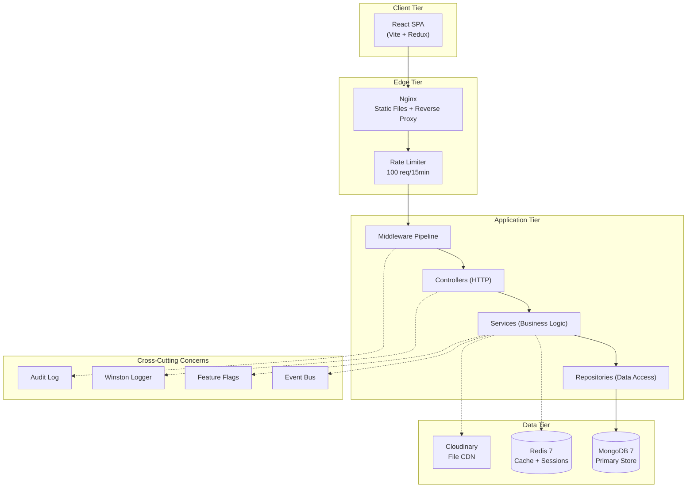
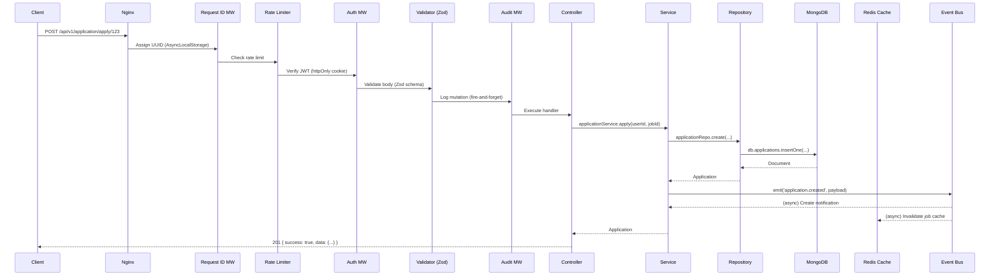
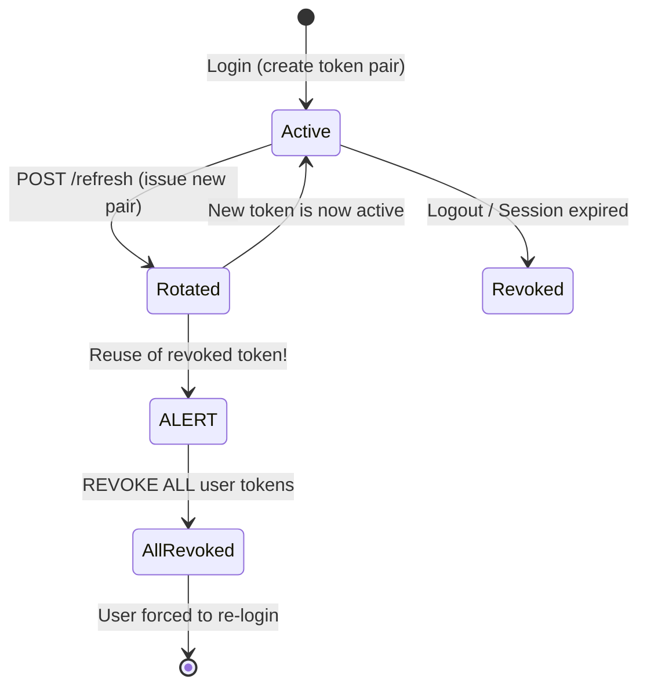
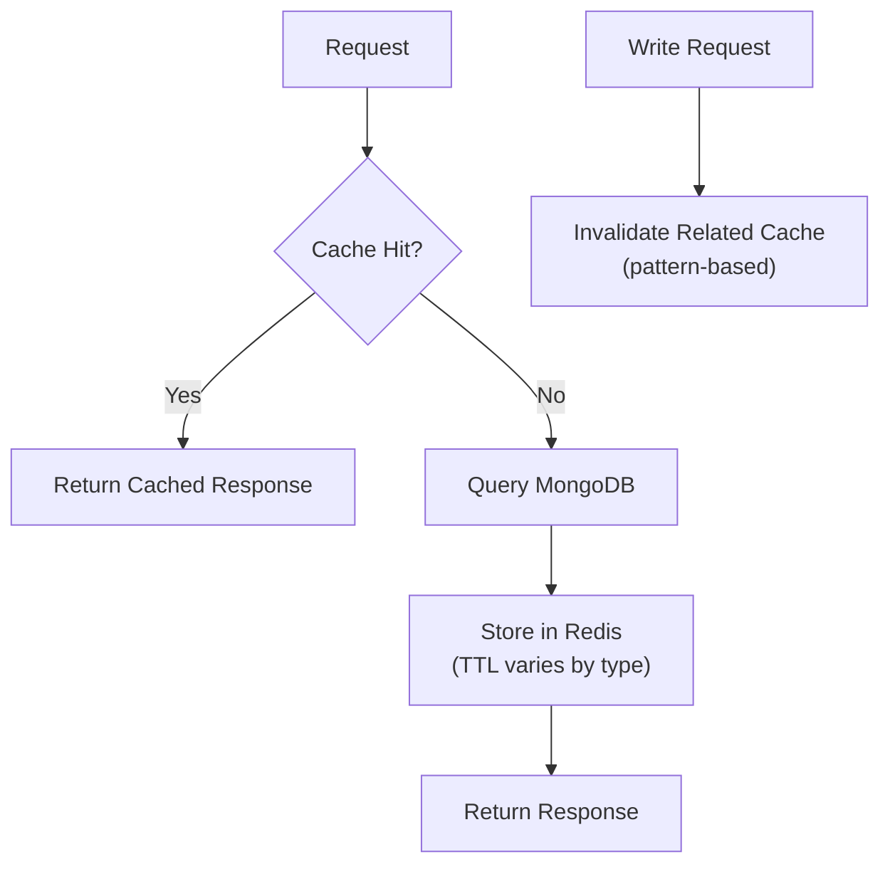
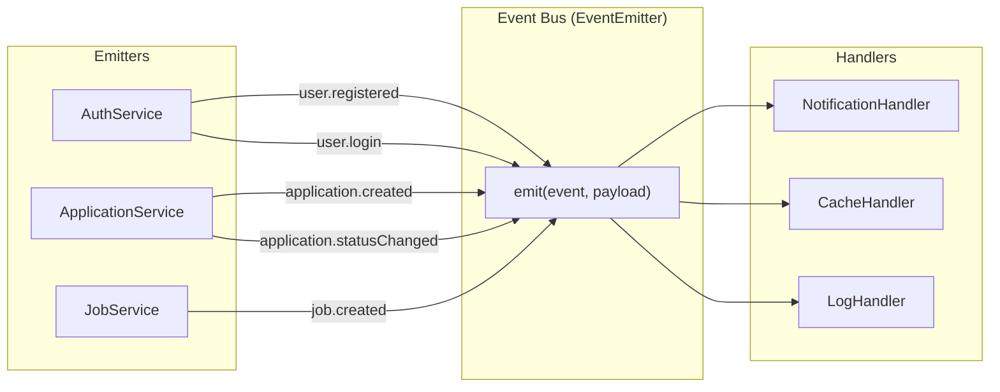
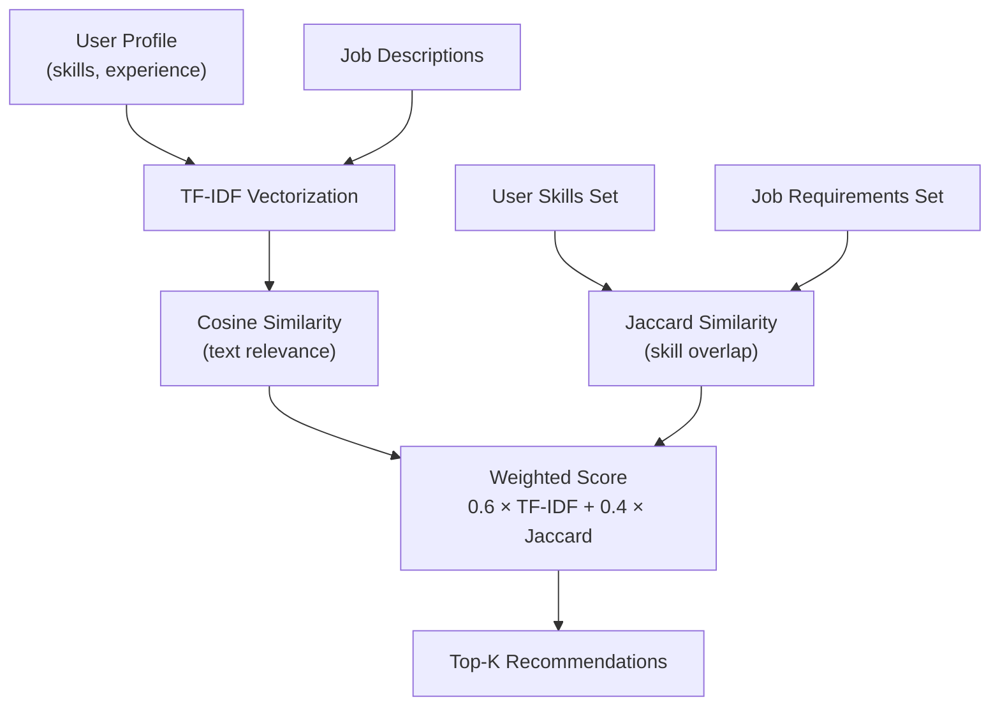

# System Design — RozgarHub

This document explains the architectural decisions, data flows, and scaling strategies behind RozgarHub. It's written as a system design reference — the kind you'd walk through in a MAANG system design interview.

---

## Table of Contents

- [High-Level Architecture](#high-level-architecture)
- [Request Lifecycle](#request-lifecycle)
- [Authentication Flow](#authentication-flow)
- [Caching Strategy](#caching-strategy)
- [Event-Driven Architecture](#event-driven-architecture)
- [Database Design Decisions](#database-design-decisions)
- [Recommendation Engine](#recommendation-engine)
- [Resilience Patterns](#resilience-patterns)
- [Trade-off Analysis](#trade-off-analysis)
- [Scaling Roadmap](#scaling-roadmap)

---

## High-Level Architecture



### Design Principles

1. **Layered Architecture**: Each layer has a single responsibility and only depends on the layer below it.
2. **Dependency Inversion**: Services depend on repository interfaces, not Mongoose models directly.
3. **Fail-Safe Defaults**: Redis unavailable? App works without caching. Feature flag unconfigured? Defaults to enabled.
4. **Event-Driven Decoupling**: Side effects (notifications, cache invalidation) happen via events, not direct calls.

---

## Request Lifecycle

Every API request follows this exact path:



### Key Observations

- **Request ID** is assigned first — every log entry for this request will contain the same UUID.
- **Audit logging** is fire-and-forget — it doesn't block the response.
- **Event bus** reactions are async and error-isolated — a notification failure doesn't fail the API response.

---

## Authentication Flow

### Dual-Token Strategy

```
┌─────────────────────────────────────────────────────────────────┐
│                    WHY DUAL TOKENS?                             │
│                                                                 │
│  Single token approach:                                         │
│  - Long-lived token → Stolen token has long window of abuse     │
│  - Short-lived token → User logs in every 15 minutes            │
│                                                                 │
│  Dual token approach:                                           │
│  - Access token: 15 min (short, used for every request)         │
│  - Refresh token: 7 days (long, used only to get new access)    │
│  - Best of both worlds: short exposure window + long session     │
└─────────────────────────────────────────────────────────────────┘
```

### Token Rotation & Theft Detection



**Theft detection logic**: When a refresh token is used, the old one is revoked and a new one is issued. If someone tries to use the old (revoked) token, it means either:
- The legitimate user's token was stolen, OR
- An attacker's token was stolen

In both cases, revoking ALL tokens is the safest response (forces everyone to re-login).

### Cookie Configuration

```
accessToken:  httpOnly=true, secure=true, sameSite=strict, maxAge=15min
refreshToken: httpOnly=true, secure=true, sameSite=strict, maxAge=7d, path=/api/v1/auth
```

- `httpOnly`: Not accessible via JavaScript (prevents XSS token theft)
- `sameSite=strict`: Not sent in cross-site requests (prevents CSRF)
- `path=/api/v1/auth`: Refresh token only sent to auth endpoints (reduces attack surface)

---

## Caching Strategy

### Read-Through Cache Pattern



### Cache TTL Strategy

| Data Type | TTL | Rationale |
|-----------|-----|-----------|
| Job listings | 60s | Changes frequently (new postings) |
| Job details | 300s | Less volatile, high read frequency |
| Analytics | 300s | Expensive aggregation, acceptable staleness |
| User profiles | Not cached | Personalized, low read frequency |
| Recommendations | Not cached | Personalized, computed per-user |

### Invalidation Patterns

```typescript
// When a new job is posted:
cache.invalidatePattern('jobs:*');       // All job listing pages
cache.del(`job:${jobId}`);               // Specific job detail

// When an application status changes:
cache.invalidatePattern('analytics:*');  // Recalculate stats
```

### Graceful Degradation

Redis is treated as a **performance optimization, not a dependency**:
- `getRedisClient()` returns `null` if Redis is unavailable
- Cache middleware checks for null and skips caching
- App functions correctly at all times, just slower without cache

---

## Event-Driven Architecture

### Event Bus Design



### Why Events Over Direct Calls?

| Without Events | With Events |
|---|---|
| `apply()` calls `notificationService.create()` | `apply()` emits `application.created` |
| `apply()` calls `cache.invalidate()` | Handlers react independently |
| `apply()` calls `emailService.send()` | New side effects = new handler (zero changes to `apply`) |
| `apply()` fails if email service is down | `apply()` succeeds regardless of handler failures |

### Error Isolation

```typescript
// In eventBus.ts:
try {
  handler(payload);
} catch (error) {
  logger.error(`Handler failed: ${error.message}`);
  // Error is logged but does NOT propagate to the emitter
}
```

---

## Database Design Decisions

### Index Strategy

| Collection | Index | Type | Purpose |
|-----------|-------|------|---------|
| `users` | `email` | Unique | Login lookup |
| `users` | `username` | Unique | Profile URL |
| `jobs` | `title, description` | Text | Full-text search |
| `jobs` | `created_By` | Regular | Employer's jobs |
| `applications` | `{job, applicant}` | Compound unique | Prevent duplicate applications |
| `savedJobs` | `{userId, jobId}` | Compound unique | Prevent duplicate saves |
| `refreshTokens` | `expiresAt` | TTL | Auto-delete expired tokens |
| `notifications` | `{recipient, isRead}` | Partial filter | Unread count query |
| `auditLogs` | `createdAt` | TTL (90d) | Auto-cleanup |

### Why MongoDB Over SQL?

| Factor | MongoDB (chosen) | PostgreSQL |
|--------|-------------------|------------|
| Schema flexibility | ✅ Jobs have varying fields | ❌ Requires migrations for every change |
| Embedded documents | ✅ User.profile.skills as array | ❌ Separate skills table + JOIN |
| Aggregation | ✅ Native pipeline (analytics) | ✅ SQL aggregation |
| Scaling | ✅ Horizontal sharding | ⚠️ Vertical first, then complex sharding |
| Transactions | ⚠️ Supported but not default | ✅ Built-in ACID |

**Trade-off**: We sacrifice strong transactional consistency for schema flexibility and horizontal scalability — appropriate for a job portal where eventual consistency is acceptable.

---

## Recommendation Engine

### Algorithm: TF-IDF + Jaccard Similarity



### Why Not a 3rd-Party ML Service?

- **Zero external dependencies** — no API keys, no latency, no cost
- **Interpretable** — we can explain why a job was recommended
- **Fast** — computed in-process, no network round-trips
- **Good enough** — TF-IDF is the same algorithm used by early Google

---

## Resilience Patterns

### 1. Retry with Exponential Backoff + Jitter

```
Attempt 1: wait 0ms
Attempt 2: wait 200ms + random(0, 200)ms
Attempt 3: wait 400ms + random(0, 400)ms
...
```

The jitter prevents the **thundering herd problem**: if 1000 clients fail at the same time, without jitter they all retry at the same time, overwhelming the server again.

### 2. Idempotency Keys

```
Client sends: POST /apply/123, Idempotency-Key: "abc"
  → First time: execute, cache response
  → Second time: return cached response (no side effects)
```

Critical for:
- Network retries (user double-clicks "Apply")
- Mobile apps with unreliable connections
- Webhook delivery (retry semantics)

### 3. Feature Flags

```typescript
if (featureFlags.isEnabled('AI_MATCHING')) {
  // Show recommendations
} else {
  // Show simple job list
}
```

Enables:
- **Kill switches** — disable broken feature without deployment
- **Gradual rollouts** — enable for 10% of users
- **A/B testing** — compare feature variants

---

## Trade-off Analysis

| Decision | Chosen | Alternative | Rationale |
|----------|--------|-------------|-----------|
| In-process EventEmitter vs RabbitMQ | EventEmitter | RabbitMQ | Simpler for single-instance. Migrate to MQ when scaling horizontally. |
| MongoDB vs PostgreSQL | MongoDB | PostgreSQL | Schema flexibility for job/user profiles. Accept eventual consistency. |
| Redis vs Memcached | Redis | Memcached | Richer data types (sorted sets for leaderboards), persistence, pub/sub. |
| JWT vs Sessions | JWT (dual) | Server sessions | Stateless access tokens reduce DB reads. Refresh tokens stored in DB for revocation. |
| Zod vs Joi | Zod | Joi | TypeScript-native, smaller bundle, better inference. |
| AsyncLocalStorage vs cls-hooked | AsyncLocalStorage | cls-hooked | Native Node.js API (no external dependency). |
| Nginx vs Express static | Nginx | express.static | 10x faster for static files, handles caching headers and gzip natively. |

---

## Scaling Roadmap

### Current: Single Instance (handles ~500 concurrent users)

```
[Nginx] → [Node.js API] → [MongoDB] + [Redis]
```

### Stage 2: Horizontal Scaling (~5,000 users)

```
[Load Balancer]
    ├── [Node.js API 1]
    ├── [Node.js API 2]  ──→ [Redis Cluster] ──→ [MongoDB Replica Set]
    └── [Node.js API 3]
```

Changes needed:
- Replace `EventEmitter` with Redis Pub/Sub or RabbitMQ
- Use Redis for session storage (currently per-instance)
- MongoDB replica set for read scaling

### Stage 3: Microservices (~50,000+ users)

```
[API Gateway]
    ├── [Auth Service]
    ├── [Job Service]        ──→ [Elasticsearch]
    ├── [Application Service]
    ├── [Notification Service] ──→ [Kafka]
    └── [Recommendation Service] ──→ [ML Pipeline]
```

Changes needed:
- Break monolith into domain services
- Event bus → Kafka for event streaming
- MongoDB text search → Elasticsearch
- TF-IDF → ML model (collaborative filtering)

---

*This document is a living artifact — update it as the architecture evolves.*
